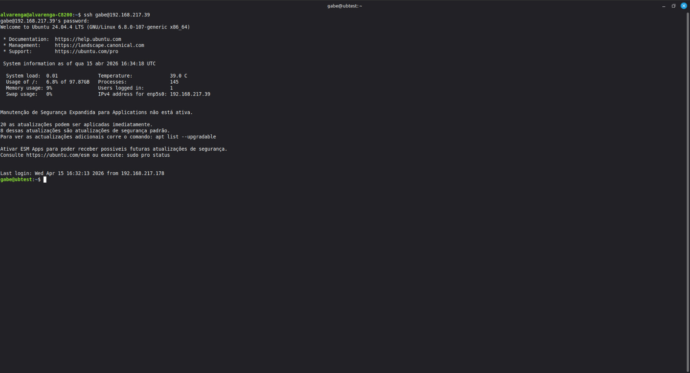
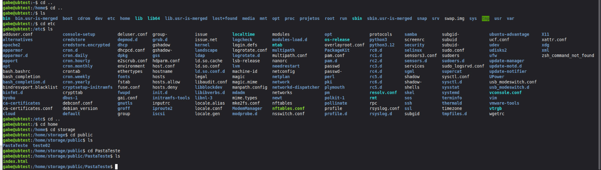
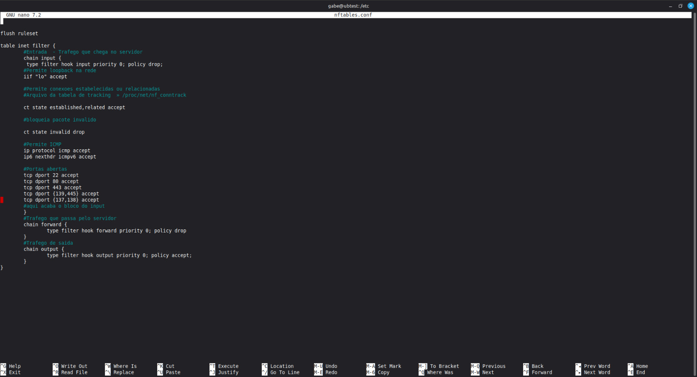

# Ubuntu Server Lab: NAS

Este projeto documenta a configuração de um servidor dedicado a **armazenamento em rede (NAS)** utilizando **Ubuntu Server**, com forte ênfase em **segurança de rede através do Nftables** e **endurecimento do acesso SSH**.

O objetivo é criar uma solução robusta, segura e acessível para centralização de ficheiros dentro de uma rede local.

---

## Objetivos do Projeto

- **NAS (Network Attached Storage):**  
  Centralizar o armazenamento de ficheiros acessíveis por múltiplos dispositivos na rede local.

- **Controle de Acesso:**  
  Garantir autenticação segura e permissões adequadas no compartilhamento.

- **Segurança Avançada:**  
  Implementar uma política de firewall baseada em *Default Drop* utilizando Nftables.

- **Hardening SSH:**  
  Reforçar o acesso remoto com chaves criptográficas, porta personalizada e proteção contra força bruta.

---

## Stack Técnica

| Componente            | Tecnologia                      |
|----------------------|---------------------------------|
| Sistema Operativo    | Ubuntu Server 24.04 LTS         |
| Serviço Principal    | Samba (SMB/CIFS)                |
| Segurança de Rede    | Nftables (Firewall nativo)      |
| Acesso Remoto        | SSH com autenticação por chaves |
| Proteção Brute-Force | Fail2Ban                        |
| Cliente de Teste     | Linux Mint (Nemo File Manager)  |

---

## Arquitetura do Projeto

O servidor atua como um **NAS centralizado**, permitindo:

- Compartilhamento de ficheiros via protocolo SMB  
- Acesso controlado por utilizador  
- Proteção de rede via firewall restritivo  
- Acesso remoto seguro via SSH com autenticação por chave pública  

---

## Hardware: Implementação em Servidor Físico

Ao invés de utilizar máquinas virtuais, todo o projeto foi implementado diretamente em hardware real. Isso trouxe um nível maior de controle sobre o ambiente e exigiu uma preparação completa da máquina.

- **Preparação do equipamento:**  
  Foi feita a limpeza interna dos componentes e substituição de peças essenciais, incluindo instalação de processador e um HD, garantindo estabilidade para uso contínuo.

- **Instalação direta do sistema:**  
  O Ubuntu Server foi instalado diretamente no disco físico, com particionamento manual e configuração real de dispositivos (como `/dev/sda`), sem abstrações de virtualização.

- **Aproveitamento total de recursos:**  
  Sem camada de hypervisor, o servidor utiliza diretamente CPU e memória, o que reduz latência e melhora o desempenho no acesso aos ficheiros via rede.

---

## Configuração Passo a Passo

### 1. Estrutura de Armazenamento

```bash
sudo mkdir -p /home/storage/public
sudo chown -R seuUser:seuUser /home/storage/public
sudo chmod -R 775 /home/storage/public
```

---

### 2. Configuração do Samba

**Arquivo:** `/etc/samba/smb.conf`

```ini
[MeuStorage]
   comment = Pasta Publica Ubuntu
   path = /home/storage/public
   read only = no
   browsable = yes
   writable = yes
   guest ok = no
```

---

### 3. Firewall e Segurança (Nftables)

**Arquivo:** `/etc/nftables.conf`

```conf
flush ruleset

table inet filter {

    # Entrada: Trafego que chega no servidor
    chain input {
        type filter hook input priority 0; policy drop;

        # Permite loopback na rede
        iif "lo" accept

        # Permite conexoes estabelecidas ou relacionadas
        # Arquivo da tabela de tracking: /proc/net/nf_conntrack
        ct state established,related accept

        # Bloqueia pacote invalido
        ct state invalid drop

        # Permite ICMP
        ip protocol icmp accept
        ip6 nexthdr icmpv6 accept

        # Portas abertas
        tcp dport 22 accept
        tcp dport 80 accept
        tcp dport 443 accept
        tcp dport { 139, 445 } accept
        tcp dport { 137, 138 } accept
    }

    # Trafego que passa pelo servidor
    chain forward {
        type filter hook forward priority 0; policy drop
    }

    # Trafego de saida
    chain output {
        type filter hook output priority 0; policy accept;
    }
}
```

> **Nota:** A política *Default Drop* garante que apenas as portas explicitamente listadas recebem tráfego. Todo o resto é descartado silenciosamente.

---

### 4. Endurecimento (Hardening) do SSH

Com o servidor exposto na rede local, o acesso remoto precisa de proteção adicional. As medidas abaixo foram aplicadas para blindar o SSH.

#### 4.1 Geração de Chave SSH no Cliente

```bash
ssh-keygen -t ed25519 -C "seu@email.com"
```

> O algoritmo **Ed25519** é moderno, compacto e mais seguro que RSA.

#### 4.2 Cópia da Chave Pública para o Servidor

```bash
ssh-copy-id gabe@192.168.217.39
```

Após isso, o login com senha torna-se desnecessário. O acesso é feito diretamente com a chave privada.

#### 4.3 Hardening do arquivo `/etc/ssh/sshd_config`

```bash
sudo nano /etc/ssh/sshd_config
```

Configurações recomendadas:

```ini
# Desativa login como root
PermitRootLogin no

# Desativa autenticação por senha (usa apenas chaves)
PasswordAuthentication no

# Troca a porta padrão (opcional, dificulta scanners automáticos)
Port 2222

# Limita tentativas de autenticação
MaxAuthTries 3

# Desativa autenticação por teclado interativo
KbdInteractiveAuthentication no
```

Após editar, reinicie o serviço:

```bash
sudo systemctl restart ssh
```

> ⚠️ **Atenção:** Antes de desativar a autenticação por senha, certifique-se de que o login por chave funciona corretamente. Caso contrário, poderá perder o acesso ao servidor.

#### 4.4 Instalação do Fail2Ban

O **Fail2Ban** monitora os logs do sistema e bane automaticamente IPs que falham na autenticação repetidas vezes.

```bash
sudo apt install fail2ban -y
```

Crie um arquivo de configuração local:

```bash
sudo cp /etc/fail2ban/jail.conf /etc/fail2ban/jail.local
sudo nano /etc/fail2ban/jail.local
```

Configuração recomendada para SSH:

```ini
[sshd]
enabled  = true
port     = 2222
maxretry = 3
bantime  = 1h
findtime = 10m
```

Ative e inicie o serviço:

```bash
sudo systemctl enable fail2ban
sudo systemctl start fail2ban
```

Verifique o status dos bans:

```bash
sudo fail2ban-client status sshd
```

---

## Acesso ao Servidor

### Acesso aos ficheiros via SMB

```text
smb://SEU_IP_AQUI/MeuStorage
```

### Acesso remoto via SSH

```bash
ssh -p 2222 gabe@192.168.217.39
```

---

## Evidências da Implementação

### Acesso ao Servidor via SSH (com senha)

<p align="center">
  
</p>

**Descrição:** Acesso remoto ao servidor via SSH, exibindo informações do sistema como carga, uso de disco, memória e endereço IP.

---

### Acesso via SSH com Chave Ed25519

<p align="center">
  
</p>

**Descrição:** Geração do par de chaves Ed25519 no cliente (`ssh-keygen`), cópia para o servidor via `ssh-copy-id` e login bem-sucedido sem senha. O servidor exibe informações atualizadas do sistema, confirmando o acesso autenticado por chave.

---

### Estrutura de Diretórios do NAS

<p align="center">
  
</p>

**Descrição:** Estrutura de diretórios criada para o armazenamento (`/home/storage/public`), com pastas e ficheiros de teste confirmando o funcionamento do compartilhamento.

---

### Configuração do Firewall com Nftables

<p align="center">
  
</p>

**Descrição:** Arquivo `/etc/nftables.conf` com política *default drop*, liberação seletiva de portas e regras de tracking de conexões.

---

## Resultados e Aprendizagem

- Administração Linux (permissões, diretórios e serviços)
- Protocolo SMB/CIFS com Samba
- Firewall com Nftables (*Default Drop*)
- Acesso remoto seguro com SSH e autenticação por chave Ed25519
- Proteção contra força bruta com Fail2Ban
- Boas práticas de hardening em servidores Linux

---

## Conclusão

Este projeto demonstra a criação de um NAS seguro e eficiente em hardware físico real, com foco em armazenamento centralizado, firewall restritivo e acesso remoto blindado. A adição do hardening SSH eleva significativamente o nível de segurança do ambiente, tornando-o mais próximo de um cenário de produção real.
